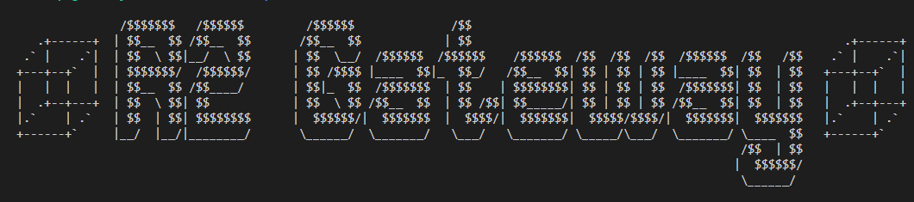

# 📦 Debian Repository Manager 📦

&emsp; Debian Repository Manager helps you manage Debian package repositories. You can use it to create a new repository or update an existing one. You can also sign packages with your GPG key and reset the apt repository.

## 🚀 Usage

### `-c`, `--create`:
 >&emsp;Creates a Debian Package Repository in the directory specified in the script. This option will create the directory structure, initialize the Packages file, and generate the Packages and Release files. For more information about Debian packaging, see the Debian Wiki.

### `-u`, `--update`:
 >&emsp;Updates an existing Debian Package Repository. This option will regenerate the Packages and Release files. For more information about Debian packaging, see the Debian Wiki.

### `-s`, `--sign`:
>&emsp;Sign package files with GPG key. This option takes one or more package file paths as arguments and signs them with your GPG key. For more information about GPG key management, see the Debian Wiki.

### `-r`, `--reset`:
 >&emsp;Reset apt repository. This option will backup the current repository files in your home directory, update the package cache, and upgrade the packages. For more information about apt, see the Debian Wiki.

## 🔑 GPG Key
>&emsp;By default, this script uses a default GPG key ID that you need to replace with your own GPG key ID. For more information about GPG key management, see the Debian Wiki.

## 💻 System Requirements
>&emsp;This script is designed to work on Debian-based systems. For more information about Debian, see the Debian Wiki.

## 📁 Repository Directory
>&emsp;This script assumes that the repository directory is set to `~/debian-repo`. You can change this directory by modifying the REPO_DIR variable in the script.

## 📦 Debian Package Lifecycle

The Debian package lifecycle can be broadly divided into several stages:

1. Package Creation
    * Packages are created by developers or maintainers and are typically built from source code using `dpkg-buildpackage`.

2. Package Upload
    * Packages are uploaded to the Debian package repository, where they are processed and included in the repository.

3. Package Maintenance
    * Packages are maintained by a dedicated team of maintainers who are responsible for ensuring that packages are kept up-to-date and free of bugs.

4. Package Installation
    * Packages are installed on the user's system using `dpkg`, `apt-get`, or another package manager.

5. Package Upgrades
    * When new versions of packages are released, they are made available to users through package upgrades. Users can upgrade their packages using `apt-get upgrade` or a similar command.

6. Package Removal
    * Packages can be removed from the user's system using `dpkg --remove`, `apt-get remove`, or a similar command.

>&emsp;For more information on Debian packaging standards and guidelines, see the [Debian Policy Manual](https://www.debian.org/doc/debian-policy/) and the [Debian New Maintainer's Guide](https://www.debian.org/doc/manuals/maint-guide/).

